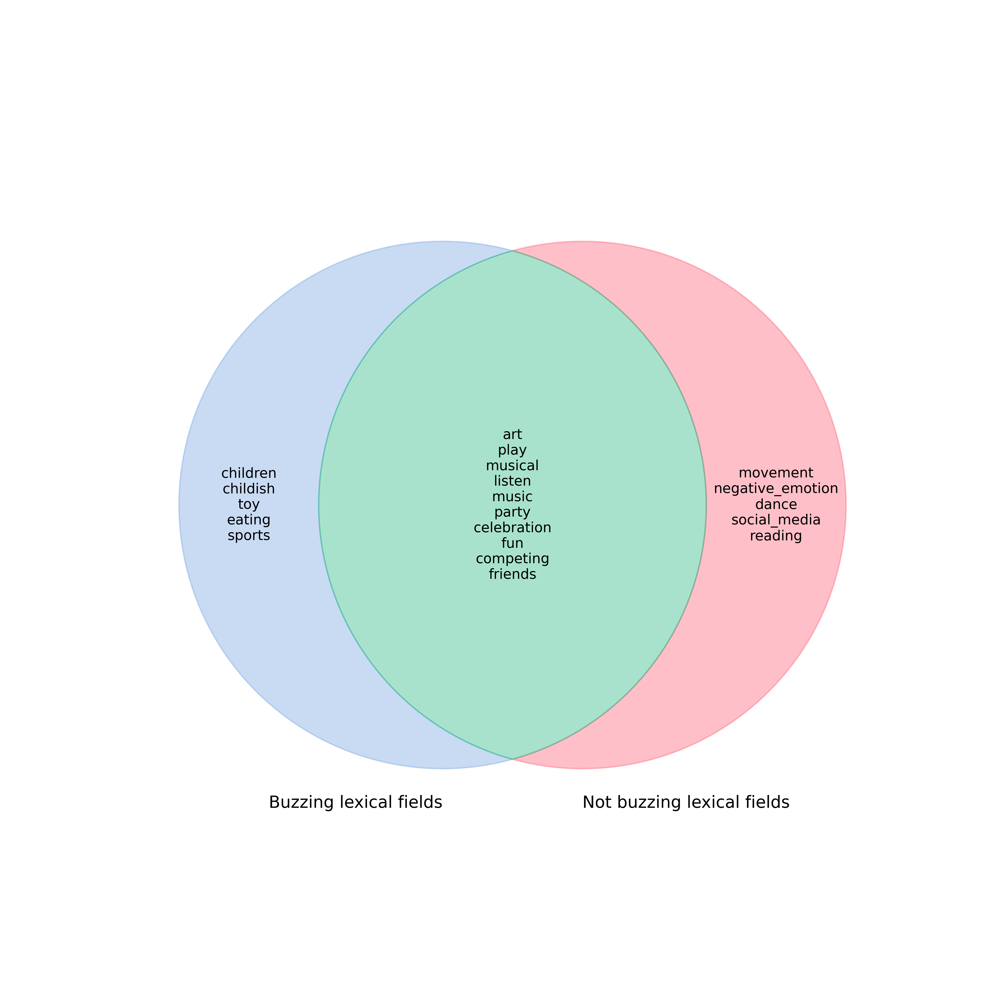
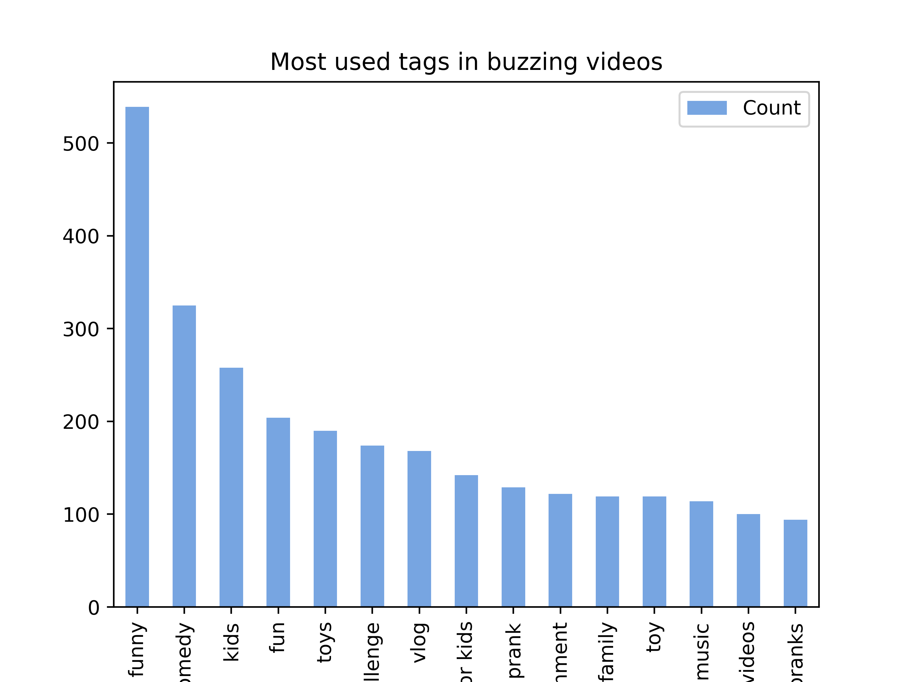
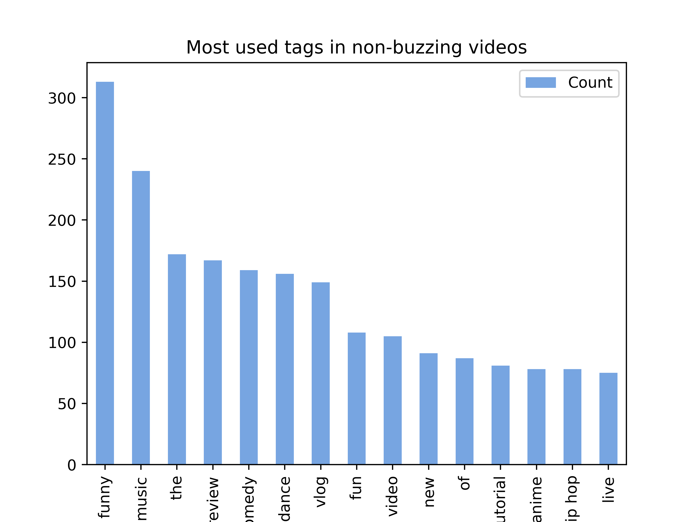
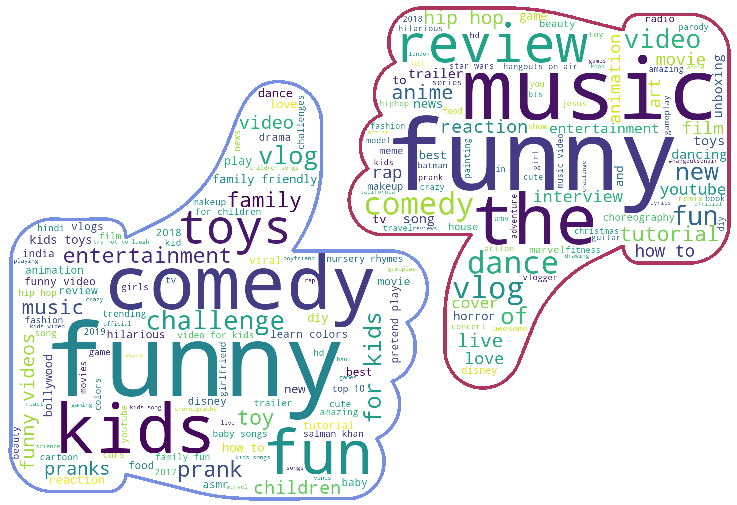
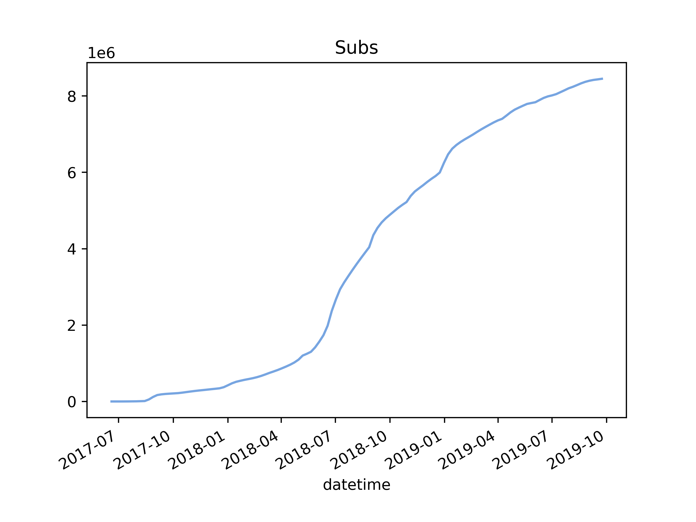

***

# Abstract
Nowadays, anyone with a smartphone and an Internet connection can become a YouTuber. Many beginners dream of success on the platform, with videos acclaimed by millions of subscribers. However, reaching fame is not as easy as it seems: indeed, with how much the number of creators has grown in the past years, it has become increasingly difficult to make an impact. The difference between famous and unknown YouTubers may lie in more than the quality of their videos. Are there any metrics in famous YouTubers' most viral videos - title, length, category, upload date - that set them apart from the rest? Could these metrics be used to create a guide for YouTubers who are starting out?

***

# The story of Ada - Chapter 1: First video and starting criteria

*Hi,*

*My name is Ada, I heard you were doing research on how small YouTubers can become successful, so that's why I reached out.*

*So here's the whole story: I'm a uni student, I like to make small vlogs about my daily life and share them with my friends. Some time ago, they suggested I put them on YouTube, which I thought was an exciting idea! Can you imagine, so many people around the world seeing my videos! So I've been uploading videos, but I've barely been getting any views... I'm so confused, what am I doing wrong? Vlogs are popular, plus I film with top-notch material and I work a lot on the editing too... Is there anything else which could help me grow my channel?*

*Thanks, Ada Westerlain*

# Evaluating relevant criteria for the success of a YouTube video

Dear Ada,

Thanks for reaching out to us! We’ve been hard at work on our analysis, and we’d love to use it to help you. :)
We believe it's important to understand which "objective" parameters you can tune, as a content producer on YouTube, to hopefully have a better performance in the long run. 

But first, let's explain to you what kind of data we used for our research.

# What data will we analyse, and how?

To answer our questions, we will use a large dataset of YouTube channels and videos: YouNiverse. The dataset is divided into three main types of data: 
- Channel data, containing e. g. the date a channel registered on YouTube, its number of subscribers, etc.
- Video data, containing a video's title, its tags, its length and its number of views.
- Timeseries data, containing channels' weekly evolution (e. g. in terms of subscriber count) from 2015 to 2019.



We selected channels in the Entertainment category, which has the largest number of channels in the database and the least dependent on the "quality" of the content (music for example is really influenced by trends, politics by the view point taken on the given subject, and so on). Moreover, your vlog channel definitely fits into this category, so we are confident our analysis will be relevant to your content.

To quantify a channel's success, we calculated a "growth score". This score was calculated by dividing the channel's number of subscribers in its latest entry of the timeseries by the number of days the channel was active (date of the latest timeseries - date of the channel's registration). We kept the 15% of channels with the best growth score as our "buzzing" channels (positive examples of success on youtube), and the 15% with the worst score as our "quiet" channels turning this into a binary problem easier to handle.

The features we used for our analysis are varied, ranging from parameters related to the title (number of words, capitalization...), video length, data about tags (their presence, number and distribution), and weekly upload frequency of the channel.

We computed, for each channel, the mean of each of these parameters. We use means in order to attribute one value per feature per channel. Using this dataset of means across buzzing (1) and quiet (0) channels, we trained a random forest algorithm. This forest outputs whether or not a channel is likely to be successful (1) or not (0), turning our title analysis into a simpler binary problem.

Then, we ordered the parameters by order of importance, that is, by how much each of them decreases the impurity in the random forest's classification. 

Here are the feature importances:



# Importance of the title

After this first explanation, let's move on to some actual high level tips you can use in your channel's videos.

First of all, there's one thing we immediately noticed in the video you sent us: the title "day at my uni", while relevant and to the point, could be tweaked a little to be more attractive to your viewers.

Indeed, the title of a video is one of the first things a potential viewer can see before clicking on your video (perhaps only second to the thumbnail, of which we unfortunately don't have an analysis). It's bound to be important and most likely have a very palpable influence in how the video is received.

We analyzed several parameters related to the videos' titles: the number of words, the usage of capital letters, the usage of the 'featuring' lexical field - which can indicate collaboration with other YouTubers or simply the presence of other guests, which pronouns are used in the title, and finally, the presence of words related to positive or negative emotions in the title.

We trained another random forest similar to the previous one, but only with the aforementioned title-related parameters. We then ranked them by importance, using the same metric of impurity decrease to do so.



From this, we can see that among these parameters, the number of words in the title clearly has the most influence on the success of the video. Let's have a look at more specific values for this feature so you can apply it to your own videos.



As you can see in this boxplot, successful channels tend to have a few more words than quiet channels in their videos' titles, with a median of 10 words. We'd say this is due to a better ability to convey the content of the video if you use a couple more words: that is, describing your content in more detail - perhaps using more exciting adjectives as well - could boost your video's views.

Capitalization of the words in the title also seems to have a positive effect on the outcome. Here are the results of our analysis:



On average, successful channels have 30% of capitalization and quiet ones only 20%. This could be due to two reasons: firstly, having proper capitalization at the start of the title's words - like you would have in a book or movie title - can give your video a more professional air. But more importantly, since it's important for a title to be eye-catching, we believe that writing the most important words in all-caps can strongly direct the viewer's attention to them.

For featurings unfortunatly we didn't see much difference in use between buzzing and quiet channels. Besides, as you're only starting out, don't worry about collaborating with other YouTubers yet.

Similarly, for sentiment analysis of the title, the only thing we were able to conclude is that it doesn't really matter the sentiment, what matters most is using more words that describe it, for example more positive/negative adjectives.

# Another main criteria: the video's duration

Another thing we noticed is how your uni vlog is 41 minutes long. Naturally, it's always exciting to add a lot of footage to your work, but if a video is too lengthy, users may be discouraged from clicking on it, let alone viewing it all the way through. In our analysis, we found that many of our successful and quiet channels have videos much shorter than 41 minutes on average, as you can see on this boxplot which displays the durations in seconds.



If we look at the median, buzzing channels' videos are slightly longer than quieter channels', that is, around 8 minutes long (versus 5 minutes and 30 seconds for quieter channels). Since you focus on vlogs, it's likely you might want to make videos a little lengthier than this. In that case, we'd recommend aiming for a length between the median and the 3rd quartile - here, the 3rd quartile for successful channels is around 12 minutes. This 8-12 minutes interval is rather precise and corresponds to a good 25 % of our dataset's successful channels. 

To summarise, paying attention to the title of your videos as well as their duration is already a good start to make your videos more attractive. Good luck with your YouTube channel! Please let us know if you have any more questions.

---

# The story of Ada - Chapter 2: Trending topics?

*Hi!*

*I’ve got good news: the new videos I’ve posted since last time have been quite successful! I made them shorter than the uni vlog (around 10 minutes like you suggested), and I made sure to follow your advice about the title, you know adding around 10 words and capitalization and all that. I’ve even gotten a few subscribers now! Oh and don’t know if that helped, but I also changed the titles of my old videos - looking back, they were so bad hahaha*

*I think I could do even better though... Sometimes there's a big difference in the number of views I get on each video. One time, I vlogged about a sports challenge I participated in, and got over 3'000 views! But another time, I made a video about some comments I got on Instagram, and that one totally flopped! And even my most viewed videos never go over a few thousand views... Am I just making videos about lame topics or what?*

# Topic analysis - Which topics are successful for Entertainment channels on YouTube?

Dear Ada,

First of all, we're happy that our advice could help! Congrats on getting some subscribers and views in the thousands, that's already a promising milestone!

Now, about the difference in views across your videos, this can definitely be linked to the topics you present in each of them. Naturally, trending topics change over time, but we noticed a few topics that appear consistently in our buzzing channels' videos. In the following graphs, you can see which topics appear the most in buzzing channels and quiet channels, their appearance being represented by a mean score.

 


You will notice that buzzing and quiet channels tend to tackle similar topics. This overlap makes sense due to the size of the database of channels: there are simply too many videos for every single one of them to be successful. However, some of the topics are more represented in only one of the lists. One of the most blatant examples is how the lexical field of negative emotions is almost at the top of the quiet list, while being quite lower in the buzzing list. This may be a reason why your video about negative Instagram comments was not as successful as most of your other ones.

To highlight the topics that are more exclusive to buzzing channels, we created the following Venn diagram:

As you can see, there are only few common topics that are not also widely present in the quiet channels. Among these, we can find sports, which could explain the success of your sports challenge video. You could also tackle other successful topics such as food ("eating"). "toy", "children" and "childish" are popular topics as well, although they may not interest you that much as a vlogger. Their presence could be due to the fact that channels and content aimed towards children are included in the Entertainment category.

To have a clearer view of common topics, we also made a comparative graph of the realtive frequency of some common topics across both lists of channels.

Some of the topics that are common in both lists, such as "play" or "competing", are still more common among buzzing channels than quiet ones. And even for topics which are more common in quiet channels, this could be due to the sheer number of videos posted about these topics, as we explained before. In the end, the goal is not for you to restrict which topics you want to tackle, but to give you suggestions based on what is popular.

Good luck!

---

# The story of Ada - Chapter 3: Don't forget the tags!

*Wait, I actually have another question. Even my videos about trending topics never go over one thousand views... Is there something else I'm missing even though I'm using enough trendy words in my titles? Maybe it's the description... I guess I don't spend enough time on it.*

*Thanks again! Ada*

# Analysis on the usage and distribution of tags

Dear Ada,

Your question is very relevant! Thinking about the description is a good insight, as well, because another relevant feature we studied is closely related to it: the video's tags.

Intuitively, we can assume the importance of using tags makes a lot of sense with regards to YouTube's search engine: although they are barely visible to viewers, tags help categorise the video and will make it more likely to appear in the search results of a related query or in recommendations of a video with similar tags.

To analyse this assumption, we studied the usage of tags in our dataset's channels. To every video in the dataset, we assigned the value 1 if it included tags, and 0 if it did not include any tags. We then grouped the videos by channel and computed the mean use of tags across the channel's videos, ranging from 0 to 1. Here's what we found:



The results are clear: although both buzzing and quiet channels use tags in a large majority of their videos, buzzing channels use them much more consistently. Indeed, the median tag usage for buzzing channels is 1: this means that more than half of our buzzing channels use tags in every single one of their videos. If we look at the 25% quartile, the difference becomes even more drastic: it has a value of 0.985 for the buzzing channels - meaning three quarters or more of these channels use tags in at least 98.5% of their videos - while having a value of only 0.843 for quiet channels.

Now, you might wonder which tags to use. To answer this question, we studied the distribution of tags in both buzzing and quiet channels, and compiled the most used tags in both.

We observe that most of the common tags appear in both buzzing and quiet channels. This is the same kind of overlap (due to the size of the database) we mentioned in the topic analysis. We still notice, however, that certain tags appear in the buzzing list but not in the quiet one: among these, "challenge" or "prank" might be tags of interest to your channel. Of course, it can also be effective to add other relevant tags that belong to both lists, as they will improve the referencing of your video.

Adding stopwords such as "the" or "of" is not necessary at all, however. These only appears in the most common tag list for quiet videos, therefore they will likely not help much with the referencing of your videos. We think a possible reason to this would be the following: when users enter a search query, they may only type the words meaningful to their search - without adding stopwords that wouldn't help refine the search results.

Still, unlike the title, tag words do not need to be exactly relevant to your video's topic. Of course, it's not a good practice to add too many tags that have nothing to do with your video: YouTube even deems this kind of "tag spamming" to be against its terms of service. Still, without resorting to spamming, don't hesitate to branch out and add a few general words to your tags! For example, you could definitely add the word "fun" to your sports challenge video's tags, on top of the more relevant "vlog" and "challenge" (which is a tag word that is very present in buzzing channels, lucky!).

But in the end, how many should you add? If we look at the medians, buzzing channels will have around 19 tags per video, while quiet ones have around 11. With this in mind you can tune the number of tags you use to potentiate visibility of the channel!



We will give you wordclouds of the most used tags in buzzing and quiet channels, as a visual reminder.

Good luck with tagging your videos, Ada! We look forward to hearing again from you.

# The story of Ada - Chapter 4: The buzz

*Hi!!*

*So I tried adding the tags you suggested (and more!) to my sports video. And you know what? It went from 3'000 to 32'000 views in a week, I can't believe it! It's gotten me so many subscribers, too! I really feel like this is the start of my YouTuber career, omg*

*I also made a few more videos about uni, actually. I love my classes and missed talking about them in my vlogs... Unlike the first time, though, I made sure to pick a more attractive title, make the video shorter and use a bunch of tags. And they did pretty well! Maybe it's because I have more subscribers now, but I'm sure it's thanks to your advice too!*

# Final tip - ensure long term success

We are very pleased to hear that everything is working out for the best with your youtube channel, and very proud to see that our work has an impact in the real world! A buzz like this is absolutely a great way to kickstart a longer YouTube career, so congratulations! As for your uni videos, our advice probably played a part, and who knows, you may be setting a new trend!

We'll leave you with a final tip! One of the findings we came up with in our analysis was that the frequency with which a youtuber posts is different between successful and quieter content creators. Looking back at our feature importance ranking from the beginning, this is even the second most determinant feature to differentiate between a buzzing and a quiet channel.



Over 50% of buzzing channels post more than one video per week - the median being 1.4. On the other hand, the median for the quiet channels, the median is 0.5 (one video posted every two weeks). This is a conclusion we expected, as keeping up with your audience and consistently sharing content proves to be a great way to ensure long term success. Indeed, your viewers will connect to you and your content in a more meaningful way. 

On top of that, having a well known and regular post schedule is a good way to mantain engagement high and make sure that your base audience always watches your videos since they will look forward to the day you post new content.

Good luck with your YouTube career!

---

# The story of Ada - Epilogue: Ada's evolution

During and after our exchanges with her, Ada kept building up her YouTube channel and creating more content. This is what her evolution looks like, in terms of subscriber count.



---

# Conclusion

We can conclude from this analysis that, even though the most relevant predictor for success on youtube is the content itself and its quality, there are still some objective parameters that, if tuned correctly, will amplify the reach of our channel and generate more engagement, making the number of views and subcribers grow faster.

Here is the recipe we found the buzzing channels are following:
 - Around 10 words in the title,
 - At least 30% of capitalization of the words of the title,
 - Always use tags in the videos,
 - Around 20 tags per video,
 - At least 1 video per week, but it's better if you can do more,
 - Video duration around 10 minutes.

As for the topics of the videos, many topics aren't strictly determinant for an Entertainment category video's success, although some topics tend to appear much more in successful channels rather than quiet channels.

---

<<<<<<< HEAD
NB: the story and evolution of our fictional YouTuber, Ada Westerlain, was inspired by the real YouTuber Emma Chamberlain, whose channel appears in the Entertainment category of the YouNiverse dataset.
=======
NB: the story and evolution of our fictional YouTuber, Ada Westerlain, was inspired by the real YouTuber Emma Chamberlain, whose channel appears in the Entertainment category of the YouNiverse dataset.






>>>>>>> 3380e0aa989feeb19d098df67f0edc88aa5aa466
