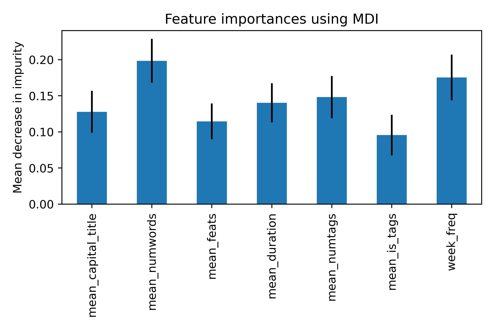

***

# Abstract
Nowadays, anyone with a smartphone and an Internet connection can become a YouTuber. Many beginners dream of success on the platform, with videos acclaimed by millions of subscribers. However, reaching fame is not as easy as it seems: indeed, with how much the number of creators has grown in the past years, it has become increasingly difficult to make an impact. The difference between famous and unknown YouTubers may lie in more than the quality of their videos. Are there any metrics in famous YouTubers' most viral videos - title, length, category, upload date - that set them apart from the rest? Could these metrics be used to create a guide for YouTubers who are starting out?

***
Let's look at the example of "name". "name" is an amateur video maker who enjoys filming small skits and sharing them with his friends. Lately, he started thinking about gathering a larger audience: and what better way to do so than post his skits on YouTube? It'll definitely give his work a lot of exposure! "name" is a bit intimidated, however. With so many entertainers on the platform, how is he going to stand out? 

# After the first video

It's been a difficult time for "name". After posting his first skit on his YouTube channel, he awaited the views, the likes and the comments. Yet, even weeks after the video was posted, it barely got around 10 views. He doesn't understand why his video flopped so badly: he chose a popular topic he was interested in, filmed the video with quality material, and worked hard on the editing too! What could be missing?





